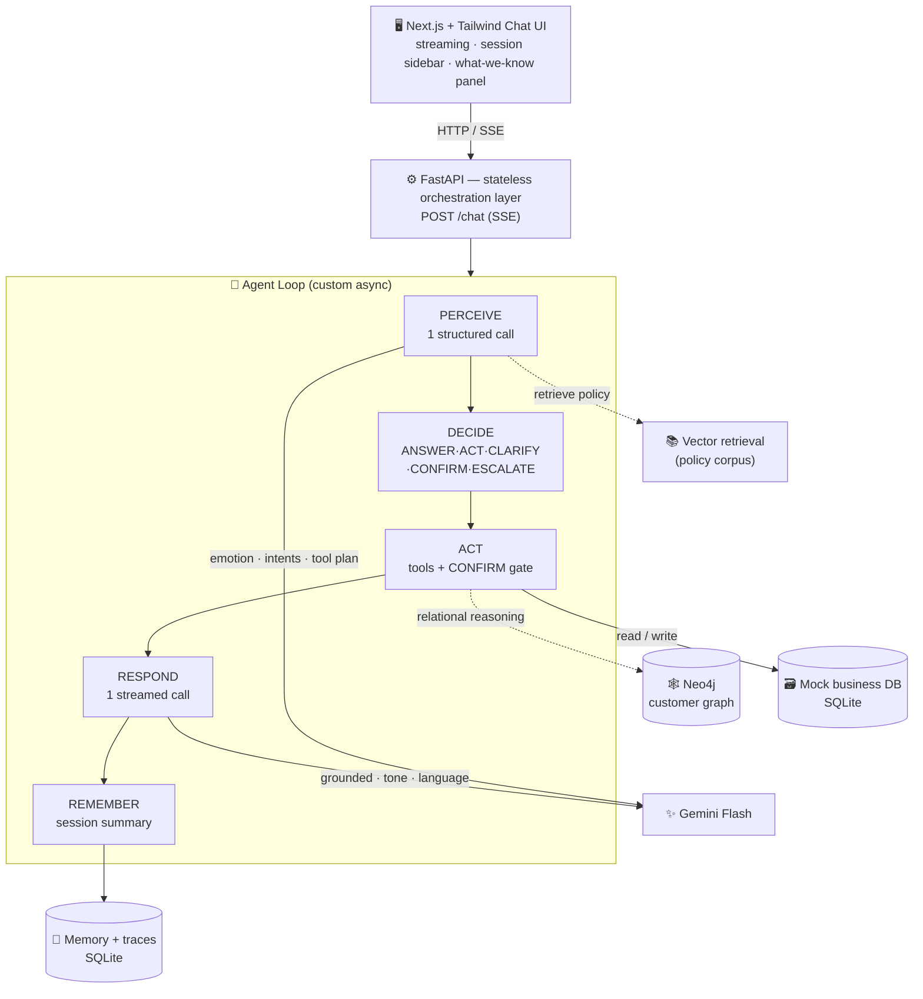
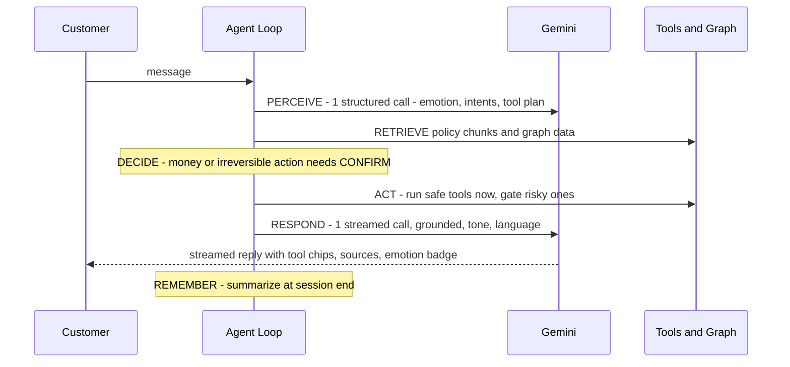

<div align="center">

# 🤝 Agentic Customer Care Bot

### A care agent that **RESOLVES** problems by taking real actions — it doesn't just tell you how to fix them yourself.

[](https://fastapi.tiangolo.com/)
[](https://nextjs.org/)
[](https://ai.google.dev/)
[](https://neo4j.com/)
[](https://www.python.org/)
[](LICENSE)

</div>

> **Clichéd bot:** *"To get a refund, please go to Orders › Returns and…"*
>
> **This bot:** *"I've checked order #1234 — it's within the 30-day window, and I can see the duplicate charge of ₹1,499. Shall I refund it now?"* → *(you say yes)* → *"Done ✅ — you'll see ₹1,499 back in 3–5 days. I've also updated your delivery address. Anything else?"*

---

## 🔗 Live Demo

| | Link |
|---|---|
| 🌐 **App (frontend)** | _add your Vercel URL here_ |
| ⚙️ **API (backend)** | _add your Render URL here_ · health: `/health` · docs: `/docs` |
| 🎥 **Demo video** | _add your video link here_ |

> ⚠️ Fill these in after deploying (see [Deployment](#-deployment)). The repo is public and every link must be live for submission.

---

## ✨ What makes it special

This is **not** a FAQ chatbot. Five differentiators, working together:

| # | Differentiator | What it means | Where it lives |
|---|---|---|---|
| 1 | 🛠️ **Agentic resolution** | Calls real tools to *do* things — issue refunds, cancel orders, update addresses — with a **confirmation gate** before anything that moves money | `backend/tools/`, `backend/agent/` |
| 2 | 🧠 **Hybrid knowledge** | **Vector retrieval** over policy docs **+** a **Neo4j customer graph** reasoned over *together* | `backend/knowledge/` |
| 3 | 🎭 **Adaptive emotional tone** | Detects anger / frustration / confusion and modulates tone — calm & apologetic, or slow & step-by-step (not naive cheerfulness) | `backend/emotion/` |
| 4 | 💾 **Cross-session memory** | Remembers the **customer**, not just the chat — *"Last time you reached out about a delayed order…"* | `backend/memory/` |
| 5 | 🙋 **Graceful escalation** | Knows its limits; hands off to a human **with a full packet** so the customer never re-explains | `backend/agent/handoff.py` |

**Plus:** multi-intent handling ("refund this **AND** change my address"), **Hinglish / code-switching**, streaming responses, a ChatGPT-style session sidebar, a live "what we know about you" panel, per-turn observability traces, and PII masking.

> 🏆 **The novelty is the *combination*.** Answering *"Your order #1234 contains item X, purchased 12 days ago — within the 30-day window — so I can refund it now"* requires **graph traversal + policy retrieval + a real tool call**. No single technique does all three.

---

## 🏗️ Architecture

Stateless backend; all state externalized (scalable, swappable stores). **~2 LLM calls per turn** by design, to stay within Gemini's free-tier limits.



### The agent loop, every turn



📄 Full design: **[`docs/architecture.md`](docs/architecture.md)**

---

## 🧰 Tech stack

| Layer | Choice | Why |
|---|---|---|
| Frontend | **Next.js 16 + Tailwind v4** | Polished, streaming chat UX |
| Backend | **Python 3.13 + FastAPI** | Async, stateless, great LLM ecosystem |
| LLM | **Gemini Flash** (`google-genai` SDK) | Free tier, 1M context, multilingual, structured output |
| Doc retrieval | **Gemini embeddings + cosine** | Reliable, dependency-light (LightRAG-swappable) |
| Customer graph | **Neo4j** (Docker / Aura) | Relational reasoning over orders → items → policies |
| Stores | **SQLite** (memory, business, traces) | Zero-setup; swappable to Postgres/Supabase |

> **Design principle:** every store sits behind a thin interface — SQLite → Postgres, Neo4j-Docker → Aura, vector → LightRAG — swappable by config, no core changes.

---

## 🚀 Quickstart

**Prerequisites:** Python 3.10+ · Node.js 18+ · a free [Gemini API key](https://aistudio.google.com/apikey) · (Docker — optional, for the graph)

<details>
<summary><b>1. Backend (FastAPI)</b></summary>

```bash
cd backend
python -m venv .venv
.\.venv\Scripts\Activate.ps1        # Windows PowerShell
# source .venv/bin/activate          # macOS/Linux
pip install -r requirements.txt

cp .env.example .env                 # then paste your GEMINI_API_KEY into .env
python -m knowledge.ingest           # one-time: embed the policy corpus
uvicorn main:app --reload --port 8000
```
Verify: <http://localhost:8000/health> · <http://localhost:8000/health/llm> · <http://localhost:8000/docs>
The mock business data **auto-seeds on first boot** (re-seed anytime with `python -m tools.seed`).
</details>

<details>
<summary><b>2. Frontend (Next.js)</b></summary>

```bash
cd frontend
npm install
cp .env.example .env.local           # NEXT_PUBLIC_API_URL defaults to http://localhost:8000
npm run dev
```
Open <http://localhost:3000>.
</details>

<details>
<summary><b>3. Optional — the Neo4j customer graph</b></summary>

The bot works without it (refund eligibility falls back to SQLite — identical answers). To enable graph reasoning + writebacks:
```bash
docker compose up -d                 # Neo4j Browser at http://localhost:7474
# set NEO4J_PASSWORD=password123 in backend/.env, then restart the backend
```
`/health` then shows `"graph_enabled": true`. Verify with `tests/test_graph_parity.py`. Swap to **Neo4j Aura** by pointing `NEO4J_URI/USER/PASSWORD` at your cloud instance — same code.
</details>

---

## 🎬 Demo scenario — "the angry double-charge customer"

One flow that exercises every differentiator (full script: [`docs/demo_script.md`](docs/demo_script.md)):

1. **Angry + Hinglish + multi-intent:** *"I was charged TWICE for order 1234 and I'm furious, also change my delivery address, kuch toh karo."*
   → emotion badge shows **frustrated**, tone turns calm + apologetic, reply mirrors Hinglish.
2. **Grounded in real data:** traverses the customer graph → finds the **duplicate ₹1,499 charge**.
3. **Confirmation gate:** *"I can refund the duplicate ₹1,499 — shall I go ahead?"* → **Yes** → refund fires (🔧 chip), graph status flips.
4. **Multi-intent:** updates the delivery address in the same turn.
5. **Cross-session memory:** *"I also see your earlier order was delayed last month — that's been delivered now."*
6. **Graceful escalation:** an out-of-scope/legal ask → hands off with a full packet (visible in the specialist inbox `GET /handoffs`).

**End state:** angry customer leaves calm, double-charge refunded, address fixed, nothing repeated, clean human handoff.

---

## 🛡️ Engineering highlights

- **Confirmation gate** (server-enforced): money/irreversible tools *never* execute without an explicit "yes" — verified by an adversarial test suite.
- **Grounded / anti-hallucination:** only states facts from retrieved policy + tool results; says *"let me check"* otherwise.
- **Graceful degradation:** Neo4j down → SQLite fallback; LLM 429 → exponential backoff; tool failure → honest reply.
- **Free-tier-aware:** ~2 LLM calls/turn (one structured PERCEIVE + one streamed RESPOND).
- **Observability:** a structured trace per turn (`GET /traces`) — emotion, action, tools, sources, latency.
- **Security/PII:** payment data masked at the source (`card ending 1234`); secrets in `.env` (never committed).
- **Tested:** scenario suites for agentic resolution, the confirm gate, memory, escalation, and multi-intent — all runnable without an API key (LLM calls faked).

```bash
backend/.venv/Scripts/python.exe tests/test_agentic_flow.py   # + test_memory / test_handoff / test_multi_intent
```

---

## 📁 Repo structure

```
customer-care-bot/
├── README.md · EXECUTION_PLAN.md · docker-compose.yml · render.yaml
├── docs/                       architecture.md · demo_script.md
├── frontend/                   Next.js + Tailwind chat UI (sidebar · panel)
├── backend/
│   ├── main.py                 FastAPI app — /chat (SSE), /sessions, /handoffs, /traces, /customer
│   ├── agent/                  loop · perception (PERCEIVE) · prompts · handoff
│   ├── knowledge/              retriever (vector) · graph (Neo4j)
│   ├── tools/                  actions · registry · business_db · seed
│   ├── memory/                 store · db · summarize (cross-session)
│   ├── emotion/                tone policy
│   ├── llm.py · config.py · pii.py
├── data/
│   ├── corpus/                 policy/FAQ markdown (grounding)
│   └── seed/
└── tests/                      scenario tests (no API key needed)
```

---

## ☁️ Deployment

- **Backend → Render:** `render.yaml` blueprint included. New → Blueprint → select this repo → enter `GEMINI_API_KEY` as a secret. (`rootDir: backend`, start `uvicorn main:app`.)
- **Frontend → Vercel:** import this repo → **Root Directory = `frontend`** → set `NEXT_PUBLIC_API_URL` to your Render URL.
- After both are live, add your Vercel URL to Render's `CORS_ORIGINS` env var, then fill in the [Live Demo](#-live-demo) links above.

---

## 📜 License

[MIT](LICENSE) — free to use and adapt.

<div align="center"><sub>Built as a thin-end-to-end-slice-first project: a talking · grounded · acting · graph-reasoning bot, layered with emotion, memory, and escalation.</sub></div>
