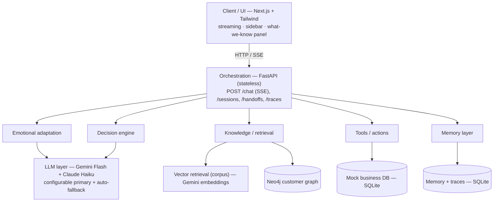

# Architecture

A deep dive into how the Agentic Customer Care Bot is built. For the quick pitch,
see the [README](../README.md).

---

## 1. Core idea

This is **not** a chatbot that *tells* customers how to solve problems. It's a care
agent that **resolves** them by taking real actions, grounded in real data, with the
judgment to confirm before irreversible steps and to hand off when it hits its limits.

Five differentiators, combined:

1. **Agentic resolution** — calls tools to *do* things (refund, cancel, update address).
2. **Hybrid knowledge** — vector retrieval over policy docs **+** a Neo4j customer graph.
3. **Adaptive emotional tone** — detects mood, modulates tone (not naive cheerfulness).
4. **Cross-session memory** — remembers the customer across conversations.
5. **Graceful escalation** — hands off to a human with a full context packet.

---

## 2. High-level layers



**Design principle — the backend is stateless.** All state (conversation, memory,
graph) lives in external stores. This is what makes it horizontally scalable, and
every store sits behind a thin interface so it's swappable (SQLite → Postgres,
Neo4j-Docker → Aura, vector → LightRAG) without core changes.

---

## 3. The agent loop (the heart)

Every user turn runs `PERCEIVE → RETRIEVE → DECIDE → ACT → RESPOND → REMEMBER`,
implemented as a custom async function ([`backend/agent/loop.py`](../backend/agent/loop.py)).

| Stage | LLM calls | What happens |
|---|---|---|
| **PERCEIVE** | 1 (structured) | One structured LLM call returns `{emotion, intents, entities, tool plan}` together — the ~2-calls-per-turn discipline (instead of 5 separate calls) |
| **RETRIEVE** | 0 | Pull policy chunks (vector) + customer/graph data + long-term memory |
| **DECIDE** | 0 | Route: `ANSWER · ACT · CLARIFY · CONFIRM · ESCALATE`; enforce the confirm gate; split multi-intent into safe vs. gated |
| **ACT** | 0 | Execute safe tools now; stage money/irreversible tools behind CONFIRM; write back to the graph |
| **RESPOND** | 1 (streamed) | Generate the reply, grounded in retrieved facts + tool results, with the tone + language directives |
| **REMEMBER** | 1 at session end | Summarize the session into long-term memory |

**Net: ~2 LLM calls per turn**, served by a dual-provider LLM layer (`backend/llm.py`):
a configurable primary (`LLM_PRIMARY` = `gemini` free-first or `claude` fast-first)
with the other provider as an automatic fallback, so a quota/outage never dead-ends.
Gemini-primary stays under the ~15 req/min free tier with backoff on 429s; Claude-primary
(Haiku) trades a small per-token cost for low latency. Embeddings always use Gemini
(Anthropic has none); the corpus is embedded once and persisted.

---

## 4. Data model

### 4.1 Customer operational graph (Neo4j)

```
(Customer)-[:PLACED]->(Order)-[:CONTAINS]->(OrderItem)-[:OF_PRODUCT]->(Product)-[:GOVERNED_BY]->(Policy)
(Order)-[:PAID_WITH]->(Payment)        (Customer)-[:RAISED]->(Ticket)
(Order)-[:REFUNDED_BY]->(Payment)       (created on refund — a writeback)
```

The refund-eligibility traversal (the showcase) is:

```cypher
MATCH (o:Order {id:$oid})-[:CONTAINS]->(:OrderItem)-[:OF_PRODUCT]->
      (p:Product)-[:GOVERNED_BY]->(pol:Policy {type:'refund'})
RETURN o.status, o.delivered_at, p.category, pol.window_days
```

The agent compares `today − delivered_at` to `window_days` to decide eligibility.
SQLite is the source of truth; the graph is a mirror used for relational reasoning —
if Neo4j is unreachable, the identical decision is computed from SQLite.

### 4.2 Document corpus (vector retrieval)

Markdown policy/FAQ files in [`data/corpus/`](../data/corpus/) (refund, returns,
shipping, warranty, FAQ). Chunked by section, embedded once with Gemini embeddings,
cosine-ranked at query time. Behind a `Retriever` interface so LightRAG can drop in.

### 4.3 Stores (SQLite)

- **business** — customers, products, orders, order_items, payments, tickets.
- **memory** — conversations, messages, customer_memory, pending_actions, handoff_packets, turn_traces.

---

## 5. Tools / actions

Each tool ([`backend/tools/`](../backend/tools/)) is a real (mock) business operation
returning a structured `{success, data, error}`. Writes also mirror to the graph.

| Tool | Type | Gate |
|---|---|---|
| `check_order_status`, `get_refund_eligibility`, `track_shipment` | read | — |
| `update_address`, `reschedule_delivery`, `create_ticket` | write | — |
| `issue_refund`, `cancel_order` | write (money/irreversible) | **CONFIRM** |

**Confirmation rule:** any tool that moves money or is irreversible must pass the
CONFIRM gate — the bot states what it's about to do and waits for an explicit "yes".
This is enforced server-side (not just by the prompt) and verified by tests.

---

## 6. Guardrails, security, scale

- **Grounding:** only state facts present in retrieved context / tool results; never invent a policy or outcome.
- **Confirmation gates:** money/irreversible actions require explicit consent.
- **PII:** payment data masked at the source (`card ending 1234`); secrets in `.env`; PII masked in logs.
- **Error handling:** tool failure → honest reply; LLM 429 → exponential backoff; Neo4j down → SQLite fallback.
- **Scalability:** stateless backend → horizontally scalable; modular tools (new action = new function); swappable stores.
- **Observability:** a structured trace per turn (perception, decision, tools, sources, latency) at `GET /traces`.

---

## 7. Build order

Built thin-end-to-end-slice-first (see [`EXECUTION_PLAN.md`](../EXECUTION_PLAN.md)):
foundation → conversational loop → grounding → agentic tools → customer graph →
emotion → memory → escalation → multi-intent/Hinglish → observability/polish → deploy.
A working talking-grounding-acting bot existed early; differentiators were layered on top.
